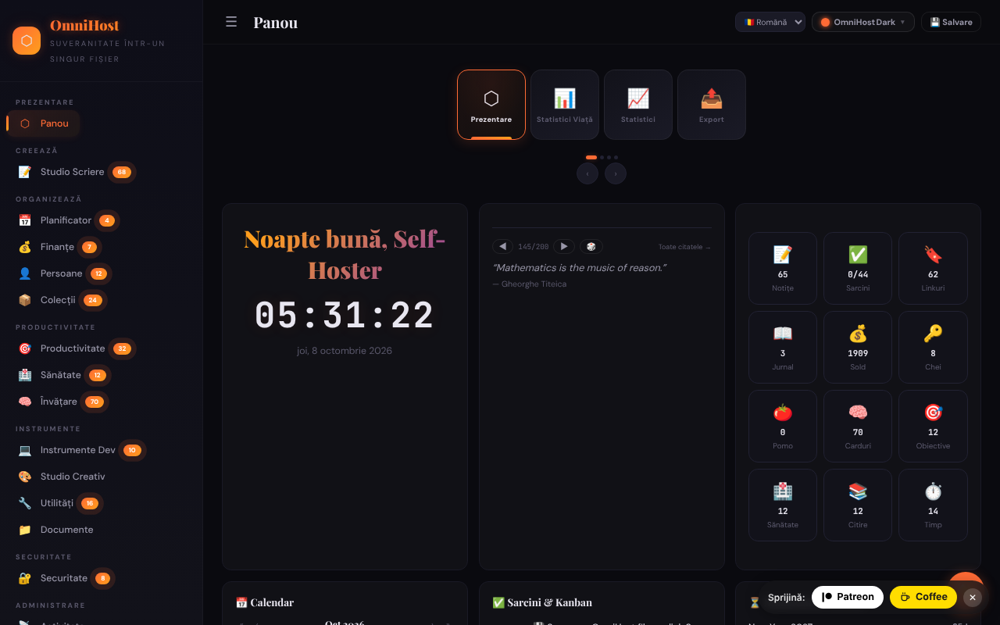

# OmniHost

Suită personală de productivitate într-un singur fișier HTML („quine"): notițe, planificator, finanțe, învățare, instrumente și multe module, inspirată de YunoHost.

**Live:** https://chiuta.github.io/OmniHost/

## Ce este

OmniHost este un fișier `index.html` (~4 MB) care funcționează ca aplicație personală completă, fără server și fără cont. Datele sunt păstrate într-un obiect JSON în interiorul fișierului (`omnihost-store`); butonul „Save" descarcă o copie a aplicației cu toate datele încorporate. Interfața afișează „141 Modules", iar descrierea din pagină îl numește „Single-File Sovereignty". Interfața implicită este în engleză.

## Funcții

Barele laterale grupează modulele (cu numărul de elemente afișat în aplicație):

- **Overview:** Dashboard (card cu salut, ceas, vreme, citat, statistici rapide, calendar, sarcini / Kanban, numărătoare inversă, activitate, „About OmniHost"), Life Stats, Stats, Export.
- **Create:** Writing Studio (Notes, Journal, Scratch, Blog, Meetings, Letters, Changelog, Knowledge, Citations, Editor, Prompts, Pipeline, Quotes).
- **Organize:** Planner (calendar, săptămână, an, rutine, mese, curățenie, sprint), Finance, People, Collections.
- **Productivity**, **Health**, **Learning** (inclusiv cartonașe / flashcards).
- **Tools:** Dev Toolkit, Creative Studio, Utilities (inclusiv dicționar și traducere, generator și scanner QR), Documents.
- **Secure:** Security (inclusiv chei). **Meta:** Activity, Settings.
- Cronologii (Univers, Galaxie, Sistem Solar, geologică, istorică etc.) și wiki încorporat cu ghiduri pentru module, în Notes.
- 30 de teme vizuale și un „Custom Studio"; mod de editare a dashboardului (reordonare prin tragere, redimensionare).
- Interfață în 71 de limbi, inclusiv română.
- Export / import JSON, resetare la „Clean Quine", vizualizare a sursei și pagină „Licenses" (credite pentru componente, inclusiv jsQR și qrcodejs).

## Manual de utilizare

1. Deschideți `index.html`. Pe Dashboard parcurgeți sarcinile de descoperire din lista „Tasks".
2. Navigați din bara laterală (☰ pe ecrane înguste) între module.
3. Schimbați limba din selectorul de limbă din bara de sus sau din Settings.
4. Alegeți tema din butonul „Theme" (30 de teme) sau din „Custom Studio".
5. Adăugați conținut în module (butonul „+ Add"; notițele acceptă Markdown).
6. **Pentru a păstra datele:** apăsați „💾 Save" (sau Settings → Save); se descarcă un nou fișier HTML cu toate datele. Folosiți acel fișier de acum încolo.
7. Copie de siguranță: Settings → „Export JSON"; restaurare cu importul JSON din Settings.
8. Pentru a reseta aplicația și a alege limba: Settings → „Clean Quine".
9. Cardurile de pe dashboard pot fi reordonate din „✏️ Edit Mode" (apoi „Done").

## Confidențialitate și rețea

- **Stocare:** obiectul principal de date este în fișierul HTML; în plus, `localStorage` folosește cheia `omnihost_db`.
- **Rețea:** codul conține câteva apeluri către terți, limitate de politica CSP (`connect-src`) la patru hosturi; toate pleacă doar după o acțiune a ta:
  - `geocoding-api.open-meteo.com` și `api.open-meteo.com` — cardul de vreme de pe Dashboard este **OPRIT implicit**; la clic pe „Show local weather” (opt-in, memorat în setările din fișier; se poate opri cu „Turn weather off”), orașul dedus din fusul orar al browserului este trimis pentru geocodare, apoi coordonatele pentru prognoză; rezultatele se păstrează în cache 30 de minute. Fără clic, la încărcare nu pleacă nicio cerere;
  - `api.dictionaryapi.dev` — doar când folosiți căutarea în dicționar (cuvântul căutat; eventual sunetul de pronunție de pe același host);
  - `api.mymemory.translated.net` — doar când folosiți traducerea din Utilities (textul de tradus).
- **Parole și secrete:** modulele Security/Passwords/TOTP păstrează datele ca text simplu în obiectul JSON din fișier și în `localStorage` (`omnihost_db`); modulul „Encrypt" este separat. Protecția din browser este doar cosmetică (nota apare și în pagina Passwords). Intrările de exemplu sunt credențiale de test publice (cheile Stripe din documentație au fost înlocuite cu un placeholder). Nu stocați aici parole importante pe un calculator partajat și nu distribuiți fișierul salvat.
- Linkurile către alte site-uri (de ex. github.com, trade-free.org, apps.yunohost.org) se deschid doar la clic.
- Fără analitice, cont sau server propriu.

## Avertisment

Instrument personal de organizare, cu caracter informativ. Modulele din grupele „Health" și „Finance" (jurnal de simptome, alergii, suplimente, calculatoare financiare, estimator de taxe etc.) nu oferă sfaturi medicale sau financiare și nu înlocuiesc un specialist. Citatele și textele-exemplu din wiki sunt conținut de demonstrație și nu au fost verificate pentru atribuire.

## Rulare locală / offline

Descărcați `index.html` (și folderul `vendor/`, care conține `jsQR.js` pentru scanner-ul QR) și deschideți-l în browser. Aproape toate modulele funcționează fără internet; vremea, dicționarul și traducerea necesită conexiune.

## Licență

CC0 1.0 Universal (domeniu public) — vezi fișierul LICENSE. Pagina „Licenses” din aplicație, antetul fișierului și textele din wiki spun acum același lucru (CC0). Componentele terțe (de ex. jsQR, qrcodejs) rămân sub licențele lor proprii, listate în pagina „Licenses”.

## Audit

2026-10-10: verificat în browser (0 erori JS; la acea dată exista o cerere automată către Open-Meteo, acum eliminată). Corectat un XSS stocat (câmpurile `priority` din sarcini și `module` din feed) care putea fi declanșat printr-un import JSON malițios, plus accesibilitate (nume pentru controale, contrast, liste Markdown). Runda 2 (2026-10-11): licența unificată spre CC0 (pagina „Licenses", wiki, flashcard); vremea pe Dashboard este acum opt-in (nicio cerere automată la încărcare); textul static „nothing is sent anywhere" din cardul About a fost aliniat la cel din i18n; cheile de test Stripe înlocuite cu placeholder.

## Autor

Alexio — Alexandru-Ionuț Chiuță. Contact: alexio@trom.tf

## English summary

OmniHost is a single-file "quine" personal productivity suite (notes, planner, finance, learning, tools, security and more; 30 themes; UI in 71 languages). Data lives inside the HTML file and in localStorage (`omnihost_db`); "Save" downloads a copy with data baked in. Network use is limited to Open-Meteo (dashboard weather, opt-in), dictionaryapi.dev (dictionary) and MyMemory (translation). CC0 1.0.
